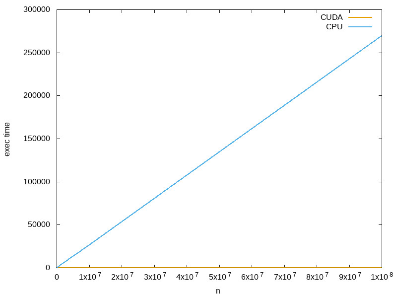
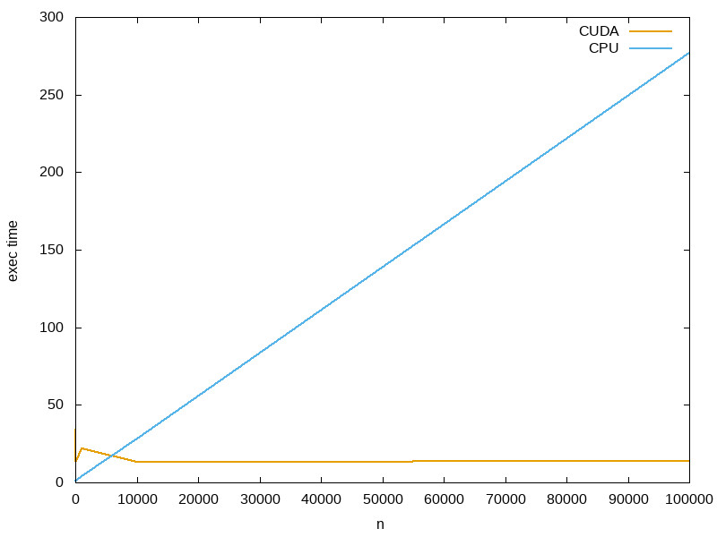

# Report Lab2

Kamil Gwiżdż & Bartłomiej Mucha

## Processing grid improvement
Our first task was to improve the code which creates the **processing grid**. As we can see the code is inefficiently 
because the processing grid is calculated depending on the amount of data to process. This way of describing grid is quite correct
but if we know available resources offered by the GPUs, it means how many streaming multiprocessors (SM) are there and how many cuda
cores are available for each SM, we can reach the maximum performance of our GPU. 

We can use the code from the first class to get this information.
```cuda
cudaSetDevice(dev);
cudaDeviceProp deviceProp;
cudaGetDeviceProperties(&deviceProp, dev);
int countMP = deviceProp.multiProcessorCount;
int cudaCoresPerMP = _ConvertSMVer2Cores(deviceProp.major, deviceProp.minor);
```

Having number of streaming multiprocessors and cuda cores for each SM we can create a grid with *countMP* blocks and for 
each block *cudaCoresPerMP* number of threads to execute our kernel function.

## Limiting factors
Our next task was to found the limitations of *addVec* code. We checked how many elements can be processed using this code.
So we started increasing the numElements in vector until our program crash. We found that program working with 5*10e7 but crashed
with 6\*10e7. In each array we are using float number so for each number it is 4 bytes in memory. We can simply calculate the sie of used memory.

```math #sum
size = 3 * 5 * 10e7 * 4 bytes = 6 GB
```
## Time comparison
After that we started to measure the execution time of our code. We added some code which add vectors using CPU. We made a few measurements for various input vector size.   

On the first plot we can see that execution time on CUDA is constant in contrast to CPU where time increase linearly. But if we look closer on the cases where the vector size is smaller than 10000.

We can see that prepare GPU to work costs about 10ms so CUDA cores are faster than CPU only if we are adding vectors larger than ~5000 elements. So if we want to add vectors that have a few elements a better choice might be to use CPU.
