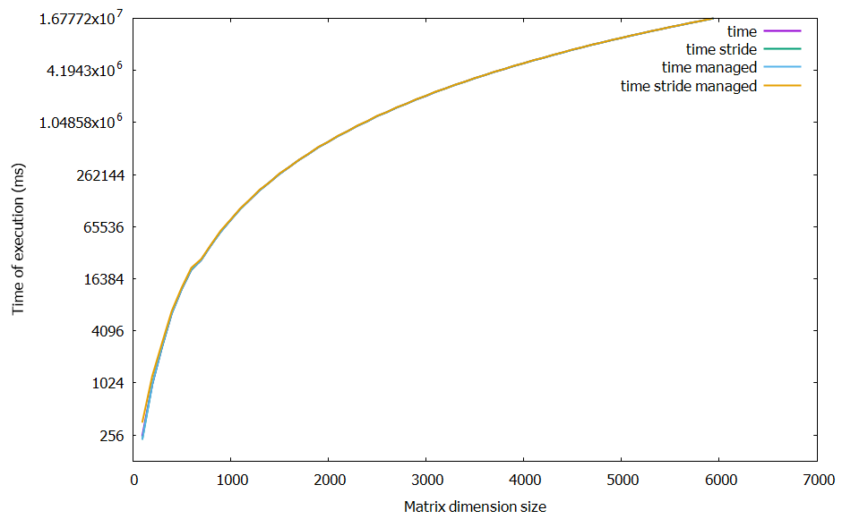

# Report Lab4

Kamil Gwiżdż & Bartłomiej Mucha

## Matrix multiplication
The topic of this report is solving the operation of matrix multiplication.
```math #sum
C = A * B
```
Two methods were implemented. The first one is straight-forward approach, where every single element in matrix is calculated in individual kernel. The other method is calculate a few matrix' element placed by a certain stride in a single kernel.

## Memory managment
Two memory managemant models were used in the methods.  
- device and host arrays are allocated are separated
<div align="center">

**32x32 device <-> host memory management**
</div>

```shell
            Type  Time(%)      Time     Calls       Avg       Min       Max  Name
 GPU activities:   48.06%  182.824s        70  2.61177s  104.12us  10.2201s  matrixMultiplication(double const *, double const *, double*, int)
                   47.99%  182.542s        70  2.60775s  103.84us  10.1987s  strideMatrixMultiplication(double const *, double const *, double*, int)
```
- arrays are allocated in unified memory, which from user perspective looks like it is shared by both device and host. In fact memory is allocated in both device and host but a background process synchronize them.
<div align="center">

**32x32 device <-> managed memory**
</div>

```shell
            Type  Time(%)      Time     Calls       Avg       Min       Max  Name
 GPU activities:   48.06%  183.560s        70  2.62229s  104.51us  10.2285s  matrixMultiplication(double const *, double const *, double*, int)
                   47.90%  182.954s        70  2.61363s  254.42us  10.2056s  strideMatrixMultiplication(double const *, double const *, double*, int)
```

The unified memory seems to be slighlty slower, however the differences are close to null. With a little research in the internet the values seems odd. On the *Kepler* architucure eventual benchmarks shows bigger differnces in execution time. However the differnces are smaller for *Pascal* architecture. In that case it seems only logical that unified memory managemant is even more optimal in the *Turing* architecture, that were used in this project.

## Grid and block layout

```shell
            Type  Time(%)      Time     Calls       Avg       Min       Max  Name
           32x32
 GPU activities:   48.90%  367.003s       140  2.62145s  103.42us  10.3127s  matrixMultiplication(double const *, double const *, double*, int)
                   48.88%  366.852s       140  2.62037s  103.84us  10.2792s  strideMatrixMultiplication(double const *, double const *, double*, int)

           10x10
 GPU activities:   49.04%  430.166s       140  3.07262s  99.772us  12.0150s  matrixMultiplication(double const *, double const *, double*, int)
                   49.03%  430.053s       140  3.07181s  101.76us  11.9901s  strideMatrixMultiplication(double const *, double const *, double*, int)

             3x7
 GPU activities:   49.58%  993.457s       140  7.09612s  188.25us  27.6538s  strideMatrixMultiplication(double const *, double const *, double*, int)
                   49.54%  992.781s       140  7.09129s  188.18us  27.6171s  matrixMultiplication(double const *, double const *, double*, int)
```
Data above clearly proofs that using odd number for a block layout is leading far from optimization. That also shows the more data is processed in single block, the faster execution is.

## Time comparison


<div align="center">

### Graph 1. Average time of execution for block layout 3x7, 10x10, 32x32
</div>


<div align="center">

### Graph 2. Time of execution for block layout 3x7
</div>


<div align="center">

### Graph 3. Time of execution for block layout 10x10
</div>


<div align="center">

### Graph 4. Time of execution for block layout 32x32
</div>

Interesting fact is that for matrix' of size 800 and 900 in case of any layout the time of exection is not as differnet as the polynomial trend for other sizes.

## Conclusion

In the end both multiplication methods didn't show much differnce in performance. The memory managment approaches also pointed out a minor difference. The optimization can be sought in block and grid layout.
