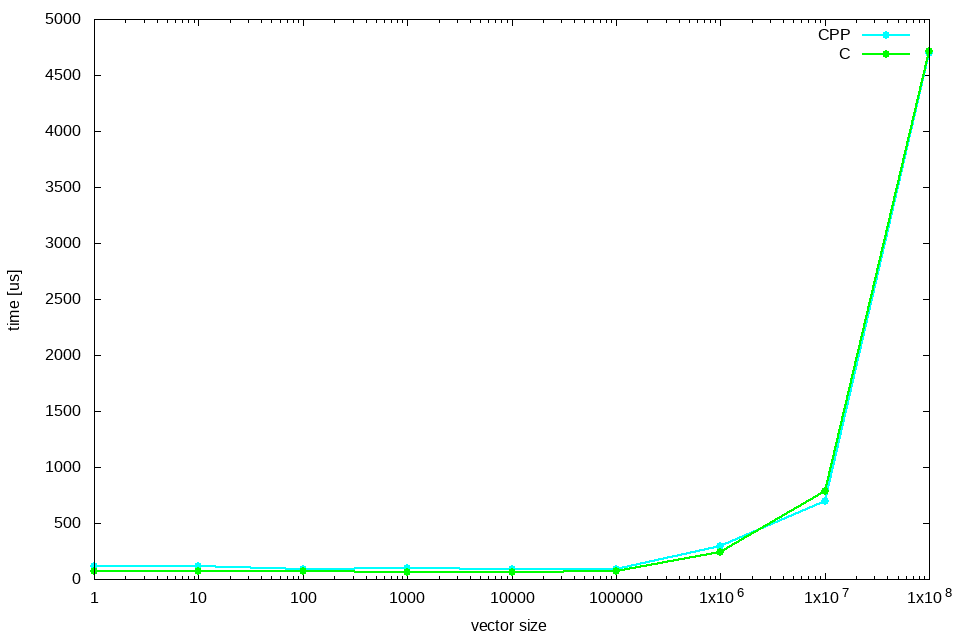

# Report Lab7

Kamil Gwiżdż & Bartłomiej Mucha

## Vector addition example
In the second task, we had to compare OpenCL implementations of vector addition in C and C++ , and then confront the results to CUDA implementation.
First when we compare code in C and C++ we can see that the way of handling OpenCL kernel in C is a little messy. We think that this code could 
be error-prone because a kernel is a simply string so for example finding a bug in string could be more time-consuming than to find a bug in a code with
syntax highlighting. C++ way of handling OpenCL is much more cleaner. The kernel implementation is stored in a diffrent file so in our opinion it is more clear.
We have used already prepared code to made some measurements.But for C++ code we decided to change the way of measuring time because default way did not give precise results.
So we changed the method to chrono high_resolution_clock.

When we look at the chart it shows that C and C++ performance is quite similar. For smaller vectors C code may be slightly faster.

After we used CUDA addVector code from NVIDIA CUDA Samples and compare it to C/C++ implementations there were no doubts that CUDA is the fastest one.
It was not a surprise to us because we think that framework for the one type of GPU could be easier to optimize than the framework which is portable.
