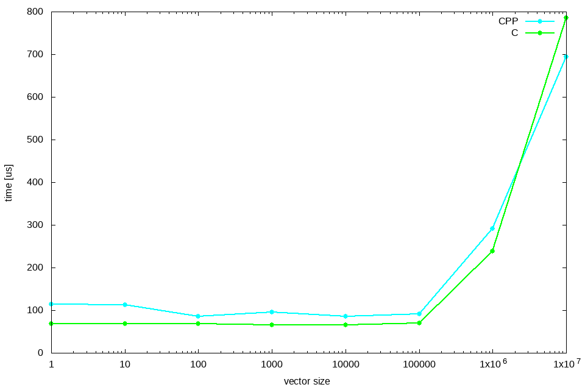
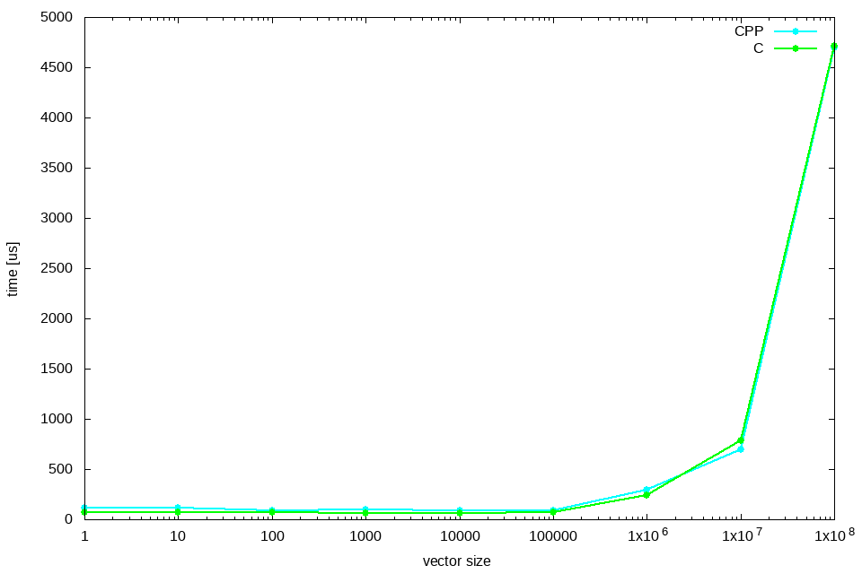
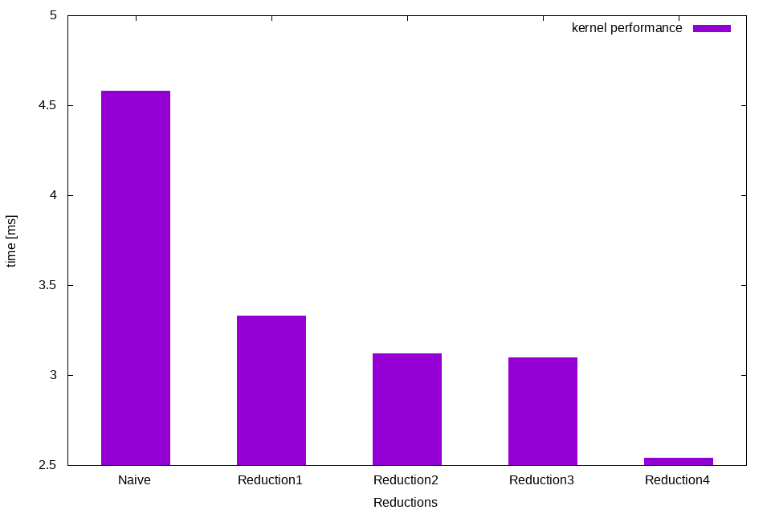

# Report Lab7

Kamil Gwiżdż & Bartłomiej Mucha

## Reduction
During the last lab we've look closer on a common parallelization problem - reduction. Our task was to implement kernels to perform the reduction of 1D list in order to obtain the usm of the numbers.
We've been concentrate mainly on one vector size which was 1024*65535. These numbers are not accidental because 1024 is maxmium number of threads per block
and 65535 is a maximum block per diamension of the grid. After some measurements we decided to run our implementations on 128 threads per block and tried to improved kernel.
Our code was inspired by Mark Harris pdf where he describes clearly the operation and implementation of the reduction.


## Naive implementation
We started from naive algorithm for parallel vector addition. We used as always nvprof tool to measure the time needed to finish kernel.
In our algorithm each thread loads one element from global toshare memory. Then we do reduction in shared memory and write result for this block to global mem.
This image from Mark Harris presentation show how it works.

```cuda
__global__ void
naive_sum_reduction(float* d_out, float* d_in, unsigned int size)
{
    unsigned int idx_x = blockIdx.x * blockDim.x + threadIdx.x;

    extern __shared__ float s_data[];

    s_data[threadIdx.x] = (idx_x < size) ? d_in[idx_x] : 0.f;

    __syncthreads();

    // do reduction
    for (unsigned int stride = 1; stride < blockDim.x; stride *= 2)
    {
        if ( (idx_x % (stride * 2)) == 0 )
            s_data[threadIdx.x] += s_data[threadIdx.x + stride];

        __syncthreads();
    }

    if (threadIdx.x == 0)
        d_out[blockIdx.x] = s_data[0];
}
```
Our kernel average time was 4.58 ms. So let's try to improve this result.

## Reduction 1
In next step we got rid of the modulo operator because it is very slow and replace divergent branch to non-divergent branch.

```cuda
    for (unsigned int stride = 1; stride < blockDim.x; stride *= 2)
    {
        int index = 2 * stride * tid;
        // thread synchronous reduction
        if (index < blockDim.x)
            s_data[index] += s_data[index + stride];

        __syncthreads();
    }
```
Average time was 3.33 ms. Only few lines and the time improved by 1 ms, quite a good result.


## Reduction 2
Sequential addressing we should get some improvement by removing unnecessary multiplication from for loop. Here is a image to illustrate how it works.


```cuda
    for (unsigned int s=blockDim.x/2; s>0; s>>=1) {
        if (tid < s) {
            s_data[tid] += s_data[tid + s];
        }
        __syncthreads();
    }
```

Average time was 3.12 ms. Not as effective as before but noticeable improvement.

## Reduction 3
First addition during load. Half of the threads are idle on first loop iteration so try to improve it.




When we look at the chart it shows that C and C++ performance is quite similar. For smaller vectors C code may be slightly faster.
Change this:
```cuda
unsigned int i = blockIdx.x * blockDim.x + threadIdx.x;
s_data[tid] = (i < size) ? d_in[i] : 0.f;
```
To this
```cuda
unsigned int i = blockIdx.x * (blockDim.x*2) + threadIdx.x;
s_data[tid] = (i < size) ? d_in[i] + d_in[i + blockDim.x] : 0.f;
```

Average time 3.10 ms. The result was similar to the previous step.

## Reduction 4
Unroll the Last Warp. In this step we saves useless work in all warps. Without unrolling, all warps execute every iteration of the for loop and if statement.

We added this
```cuda
__device__ void warpReduce(volatile float* sdata, unsigned int tid) {
  sdata[tid] += sdata[tid + 32];
  sdata[tid] += sdata[tid + 16];
  sdata[tid] += sdata[tid + 8];
  sdata[tid] += sdata[tid + 4];
  sdata[tid] += sdata[tid + 2];
  sdata[tid] += sdata[tid + 1];
}
```
And changed this
```cuda
    for (unsigned int s=blockDim.x/2; s>32; s>>=1) {
        if (tid < s) {
            s_data[tid] += s_data[tid + s];
        }
        __syncthreads();
    }

    if (tid < 32) warpReduce(s_data, tid);
```

And the result was 2.52 ms. Another big improvement.

After all measurements we draw a chart to compare all steps of improvements.


We can see that we've made the biggest leaps in performance by removing modulo and replace divergent branch to non-divergent, and then by unroll the last warp.


## Conclusion
After all algorithmic optimizations (addressing and addition during load) and code optimizations (loop unrolling) we've reduced the result from
4.58 ms to 2.52 ms so it's almost 2 times faster! 
