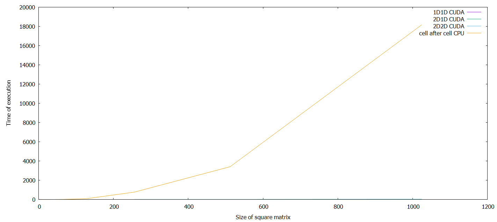
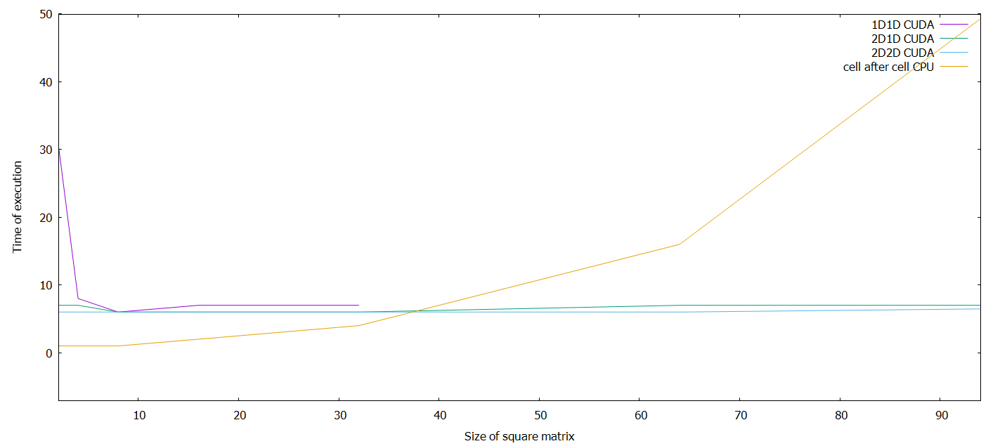

# Report Lab3

Kamil Gwiżdż & Bartłomiej Mucha

## Grid layout vs performance
The topic of the current task is checking of how does the grid layout impacts the overall performance. The example problem that was put under the investigation is matrix addition algorithm.
```math #sum
C = A + B
```
All cells were calculated individually in different threads, however the layout of blocks and grid was different as following approaches of building a grid layout were made:
 1. All threads in one dimension are placed in one block.
 2. Threads are placed in multiple one dimensional block in two dimensional grid.
 3. Threads are placed in multiple two dimensional block in two dimensional grid.
 4. For comaparision same task was executed on CPU in single thread.

The first approach quite quickly showed error about invalid CUDA kernel arguments, as maximum number  of threads per single block is 1024. Therefore curve "1D1D CUDA" on the charts ends on the case of the size of a matrices is 32 (1024 elements).

```cuda
  Maximum number of threads per multiprocessor:  2048
  Maximum number of threads per block:           1024
  Max dimension size of a thread block (x,y,z): (1024, 1024, 64)
  Max dimension size of a grid size    (x,y,z): (2147483647, 65535, 65535)
```

The second and the third approach showed almost same performance. Worthy to mention is that the third approach has at the begining slighlty better performance. However what is important about it, it is the most human-friendly approach among all described, beacuse the layout of threads can be drawn the same way the matrix would be. Grid layout and matrix' cells covers in that case.

In the end the linear calculation on single CPU thread appeard to be more efficient for matrices which size is quite small, on the hardware we were using that size was about 37.

## Time comparison
On the chart below it is clear that the fourth approach is the slowest one. Interesting fact is that the matrix addition algoritm has a linear complexity, therefore the cure "cell after cell CPU" suppose to be a stright line. However it appears to be polynomial. That might be the result of the delay of read write cycles to operation memory which might increase alongisde the size of data. The first approach, which is represented by "1D1D CUDA" curve has a wierd performance drop for a very small matrix, however it looks more like delay caused by hardawre negotioation and data exchange, as it the first task to be executed in the program.


Over a million elements matrices were handled in the second and the third approach better than 4 elements.


## Conclusion
It appears that GPU shows slightly better performance for multidemensional grid layout, however main issue that the second and the third approach solved was the restriction in number of the threads in single block.
